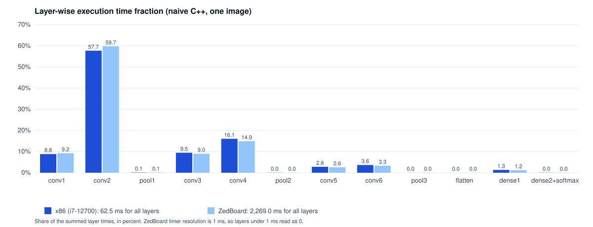

<div align="center">


Iowa State University · CprE 487/587 · Lab 2 · Team 06

[Why](#why) · [Where this lab fits](#where-this-lab-fits) · [Progress](#progress) · [Results](#results) · [Memory and MACs](#memory-and-mac-estimate) · [Build and run](#build-and-run) · [Limitations](#limitations-and-next-steps)

</div>

---

> **Where it stands — Complete**  
> All 13 layers are written and every one of the 12 TensorFlow reference outputs is reproduced for three test images, with identical errors on x86 and the ZedBoard.  
> The report and the source folder for submission are in `submission/`.

| Reference outputs matched | Max error, full model | x86, per image | ZedBoard, per image |
| :---: | :---: | :---: | :---: |
| **12 / 12** | **4.17 × 10⁻⁷** | **60 ms** (i7-12700) | **2,272 ms** |

| | |
|---|---|
| Period | Original team submission September 2026 · individual re-run started October 7, 2026 |
| Team | 2 — Zach Dixon, Jongwoo Kim |
| This repository | My re-run of Lab 2 from the course framework, checked step by step against the handout. The earlier team source and report are kept in `previous_lab_data/` |
| Stack | C++, Make, TensorFlow/Keras outputs as the reference, ZedBoard |
| Deliverables | [Lab 2 report (PDF)](submission/lab2_report_06.pdf) · [Source archive (zip)](submission/lab2_src_06.zip) · [Source folder](submission/lab2_src_06) · [Report + source in one archive](submission/lab2_06.zip) |
| Related labs | [Lab 1 — TensorFlow baseline](https://github.com/devjwk/cpre487lab1), [Lab 3 — MAC units](https://github.com/devjwk/487lab3), [Lab 4 — quantization](https://github.com/devjwk/cpre487lab4), [Lab 5 — hardware integration](https://github.com/devjwk/cpre487lab5) |

## Why

TensorFlow hides what inference costs. Lab 1 measured the model from the outside; this lab rewrites each layer as plain C++ loops so that every multiply-add is visible, countable, and ready to move onto hardware in Labs 3–5. Each layer is checked against the TensorFlow output of the same layer.

## Where this lab fits


## Starting point

- **Framework:** the course template (`course` remote), unmodified. Its own documentation is in [`FRAMEWORK_README.md`](FRAMEWORK_README.md).
- **Weights:** `data/model/` ships with the template. All 16 files are byte-identical to the weights exported in Lab 1, under different names (`conv1_weights.bin` here, `conv2d_weights.bin` there).
- **Test images:** `data/image_{0,1,2}.bin` are the three images from the Lab 1 re-run (pomegranate, miniskirt, German shepherd), converted from `uint8` to float32 in [0, 1] (49,152 bytes each). They replace the course's sample images.
- **Reference outputs:** `data/image_N_data/layer_{0..11}_output.bin` are the TensorFlow outputs of the 12 layers for those images, exported in Lab 1.
- **Import:** `python3 scripts/import_lab1_data.py <lab1_binaries_dir>` regenerates `data/` from a Lab 1 export. The course's original data is still available with `git checkout course/main -- data`.

## Progress

| Step | Status |
|---|---|
| Build the unmodified framework on the lab machine | done |
| Implement each layer (convolution with ReLU, max pooling, flatten, dense, softmax) | done |
| Verify each layer against its TensorFlow reference output | done — lab PC, 3 images |
| Verify whole-model inference | done — lab PC, 3 images |
| Layer formulas and variable descriptions (handout 3.2) | done — in the report draft |
| Memory and MAC estimate per layer (handout 3.3) | done |
| Run on the ZedBoard | done |
| Layer-wise time fraction plot | done |
| Profile with perf on x86 | done |
| Compare with TensorFlow on the same machine | done |
| Source submission folder, built and tested standalone | done |
| Report | done — `submission/lab2_report_06.pdf` |

## Results

Two runs of the same binary (g++ `-O3`, single thread), on two machines:

| Run | Machine | Log |
|---|---|---|
| A | `co2050-05`, Intel Core i7-12700 | [`results/x86_co2050_run.txt`](results/x86_co2050_run.txt) |
| B | host not recorded in the log | [`results/x86_run.txt`](results/x86_run.txt) |

Each layer is tested alone: its input is the TensorFlow output of the previous layer, so errors cannot carry over. Error is the largest element-wise difference over the three test images and is identical in both runs; time is the mean of the three images.

| # | Layer | Output | Max error vs. TensorFlow | Run A (ms) | Share | Run B (ms) | Share |
|---|---|---|---|---|---|---|---|
| 0 | conv1 5×5 | 60×60×32 | 3.94 × 10⁻⁷ | 5.508 | 8.8% | 8.216 | 5.7% |
| 1 | **conv2 5×5** | 56×56×32 | 7.75 × 10⁻⁷ | **36.068** | **57.7%** | **88.287** | **61.5%** |
| 2 | max pool 1 | 28×28×32 | 0 | 0.072 | 0.1% | 0.091 | 0.1% |
| 3 | conv3 3×3 | 26×26×64 | 4.17 × 10⁻⁷ | 5.908 | 9.5% | 12.966 | 9.0% |
| 4 | conv4 3×3 | 24×24×64 | 7.15 × 10⁻⁷ | 10.040 | 16.1% | 23.103 | 16.1% |
| 5 | max pool 2 | 12×12×64 | 0 | 0.026 | 0.0% | 0.040 | 0.0% |
| 6 | conv5 3×3 | 10×10×64 | 9.54 × 10⁻⁷ | 1.746 | 2.8% | 4.034 | 2.8% |
| 7 | conv6 3×3 | 8×8×128 | 9.54 × 10⁻⁷ | 2.268 | 3.6% | 5.157 | 3.6% |
| 8 | max pool 3 | 4×4×128 | 0 | 0.004 | 0.0% | 0.007 | 0.0% |
| 9 | flatten | 2048 | 0 | 0.000 | 0.0% | 0.002 | 0.0% |
| 10 | dense1 | 256 | 5.72 × 10⁻⁶ | 0.831 | 1.3% | 1.545 | 1.1% |
| 11 + 12 | dense2 + softmax | 200 | 8.94 × 10⁻⁸ | 0.024 | 0.0% | 0.064 | 0.0% |
| | Sum of layers | | | 62.496 | | 143.512 | |

The cosine similarity reported by the framework is 100% for every row. TensorFlow's last layer includes the softmax, so dense2 and softmax are tested together against that one reference.

**Whole model, image in to class probabilities out**

| Image | Run A | Run B | Max error | Predicted class (confidence) | TensorFlow in Lab 1 |
|---|---|---|---|---|---|
| 0 pomegranate | 61.2 ms | 143.3 ms | 4.17 × 10⁻⁷ | 170 (0.729327) | 170 (0.7293) |
| 1 miniskirt | 60.4 ms | 143.3 ms | 1.71 × 10⁻⁷ | 106 (0.103273) | 106 (0.1033) |
| 2 German shepherd | 59.2 ms | 143.2 ms | 2.09 × 10⁻⁷ | 128 (0.21062) | 128 (0.2106) |

Five further runs on `co2050-05` gave 58.5–61.5 ms per image (mean 60.2 ms, 15 measurements).

**ZedBoard** (Zynq-7000, bare metal; log in [`results/zedboard_raw.txt`](results/zedboard_raw.txt))

| Layer | ZedBoard (ms) | Share | x86 run A (ms) | Share | Slowdown |
|---|---|---|---|---|---|
| conv1 | 209.3 | 9.2% | 5.508 | 8.8% | 38× |
| **conv2** | **1,355.7** | **59.7%** | **36.068** | **57.7%** | 38× |
| conv3 | 204.0 | 9.0% | 5.908 | 9.5% | 35× |
| conv4 | 338.0 | 14.9% | 10.040 | 16.1% | 34× |
| conv5 | 58.0 | 2.6% | 1.746 | 2.8% | 33× |
| conv6 | 75.0 | 3.3% | 2.268 | 3.6% | 33× |
| max pool 1 | 2.0 | 0.1% | 0.072 | 0.1% | 28× |
| dense1 | 27.0 | 1.2% | 0.831 | 1.3% | 32× |
| Whole model | 2,272.3 | | 60.2 | | 38× |

The board's timer has 1 ms resolution, so max pool 2 and 3, flatten and dense2 + softmax read as 0 ms. All 36 layer tests and the three inference tests pass on the board with exactly the same maximum errors and predicted classes as on x86.



The chart is drawn from the logs by `python3 scripts/plot_layer_times.py`.

The machine changes the absolute time by a factor of 2.4 between the two x86 runs and 38 between x86 and the board, but not the picture: the six convolutions take 98% of the time on both, and conv2 alone 58–62%, the same layer that dominated the TensorFlow profile in Lab 1.

## C++ vs. TensorFlow on the same machine

Both measured on `co2050-05` (Intel Core i7-12700), CPU only, same three input images. TensorFlow times are the median of 20 runs after a warm-up, from `scripts/tf_inference_time.py`; its outputs match the Lab 1 reference within 2.98 × 10⁻⁷.

| Implementation | Per image | Relative to C++ |
|---|---|---|
| This framework, naive C++ (`-O3`, single thread) | 60.2 ms | 1× |
| TensorFlow, one `model.predict()` call | 34.2 ms | 1.8× faster |
| TensorFlow, direct `model(x)` call | 7.0–7.3 ms | 8.4× faster |

TensorFlow is faster even through `predict()`, whose per-call overhead is most of its 34 ms. The direct call still includes eager-execution overhead, so the layer arithmetic alone is faster again: the Lab 1 profiler measured about 1.8 ms of model operations per image, on a different machine. TensorFlow runs each convolution as one fused, vectorized oneDNN operation (`_MklNativeFusedConv2D` in the Lab 1 profile), while this framework uses six nested scalar loops.

## perf profile (x86)

`perf record --count=100000 ./build/ml` on `co2050-05`, 17,513 samples; report in `results/x86_perf_report.txt`. The profile covers the whole program: 36 layer tests, 3 full inferences, file loading and the output comparisons.

| Function | Share of cycles |
|---|---|
| `ConvolutionalLayer::computeNaive` | 97.68% |
| `DenseLayer::computeNaive` | 1.27% |
| `LayerData::compare` (test code) | 0.54% |
| `LayerData::maxDiff` (test code) | 0.23% |
| `MaxPoolingLayer::computeNaive` | 0.15% |
| everything else (loader, file I/O, allocation) | 0.13% |

perf reports functions, not layers, and all six convolutions share one function, so it cannot separate conv1 from conv2. It agrees with the timers on the totals: the timers give the six convolutions 98.5% of the layer time and dense1 1.3%. `time ./build/ml` reports 0.403 s real and 0.371 s user for the whole program, which matches 3 × 62.5 ms of layer tests plus 3 × 60.2 ms of full inferences (0.368 s).

## Memory and MAC estimate

Calculated from the layer dimensions (handout 3.3); every value is a 32-bit float. A MAC is one multiply-accumulate.

| # | Layer | Output buffer (bytes) | Weights + bias (bytes) | MACs | MAC share | Measured time share (run B) |
|---|---|---|---|---|---|---|
| 0 | conv1 | 460,800 | 9,728 | 8,640,000 | 6.57% | 5.7% |
| 1 | **conv2** | 401,408 | 102,528 | **80,281,600** | **61.01%** | **61.5%** |
| 2 | max pool 1 | 100,352 | 0 | 0 | | 0.1% |
| 3 | conv3 | 173,056 | 73,984 | 12,460,032 | 9.47% | 9.0% |
| 4 | conv4 | 147,456 | 147,712 | 21,233,664 | 16.14% | 16.1% |
| 5 | max pool 2 | 36,864 | 0 | 0 | | 0.0% |
| 6 | conv5 | 25,600 | 147,712 | 3,686,400 | 2.80% | 2.8% |
| 7 | conv6 | 32,768 | 295,424 | 4,718,592 | 3.59% | 3.6% |
| 8 | max pool 3 | 8,192 | 0 | 0 | | 0.0% |
| 9 | flatten | 8,192 | 0 | 0 | | 0.0% |
| 10 | **dense1** | 1,024 | **2,098,176** | 524,288 | 0.40% | 1.1% |
| 11 | dense2 | 800 | 205,600 | 51,200 | 0.04% | 0.0% |
| 12 | softmax | 800 | 0 | 0 | | 0.0% |
| | Total | 1,397,312 | 3,080,864 | 131,595,776 | | |

With the 49,152-byte input image the model needs about 4.5 MB, because the framework allocates every layer's output buffer up front. Convolution MACs are output values × kernel height × kernel width × input channels; dense MACs are inputs × outputs.

- **MAC count predicts time.** For all six convolutions the MAC share and the measured time share differ by less than one percentage point.
- **Memory and compute have different bottlenecks.** dense1 holds 68% of the parameters but does 0.4% of the MACs; conv2 does 61% of the MACs with 3.3% of the parameters.

## Build and run

```bash
make build      # 'make help' lists all targets; run 'make clean' first after changing a header
./build/ml      # runs the framework's checks
```

ZedBoard instructions are in [`FRAMEWORK_README.md`](FRAMEWORK_README.md).

## Submission

The handout asks for `lab2_report_06.pdf` and `lab2_src_06.zip`.

```bash
./scripts/make_submission.sh                           # rebuilds submission/lab2_src_06/ and checks it
(cd submission && zip -qr lab2_src_06.zip lab2_src_06) # the archive for Canvas
```

`make_submission.sh` copies `src/`, the `Makefile` and the three Python scripts into `submission/lab2_src_06/`, then builds that copy from scratch in a temporary directory and runs it against `data/`. It fails if the build prints any warning or error, and reports how many of the 41 comparisons pass. The data files are not part of the source archive; the program expects them in `data/` next to the `Makefile`.

`submission/lab2_src_06/`, `submission/lab2_src_06.zip` and `submission/lab2_06.zip` (report plus source folder, kept for convenience; the handout does not ask for it) are copies. After any change to `src/`, run the script and the `zip` line again.

## Repository layout

```
src/                    framework source; layers are in src/layers/
results/                test output from the x86 and ZedBoard runs
submission/             source folder for submission (generated by scripts/make_submission.sh)
data/                   weights, test images and per-layer reference outputs (imported from Lab 1)
scripts/, zedboard/     ZedBoard build, flash and file-transfer tools
CprE487_587_Lab2.pdf    lab handout
FRAMEWORK_README.md     the framework's original README
previous_lab_data/      first team implementation (src/), its report, and the README of the old repository
assets/                 README banner and figure
```

## My role

<!-- TEMPLATE: write this yourself once the work is done. -->

## What I learned

<!-- TEMPLATE: write this yourself once the work is done. -->

## Limitations and next steps

<!-- TEMPLATE: extend as the remaining steps are done. -->
- The ZedBoard timer resolves 1 ms, so layers faster than that have no usable time on the board.
- The file server on the board returns only the first 7,936 bytes of a file, so uploaded data cannot be checked by downloading it; the passing tests on the board are the check.
- The machine of run B was not recorded, so run A on `co2050-05` is the reference for all comparisons.
- The TensorFlow layer-only time (about 1.8 ms) comes from the Lab 1 profiler on a different machine; on `co2050-05` only the `predict()` and direct-call times were measured.
- Each timing is the mean of three runs of one unoptimized, single-threaded implementation. The threaded, tiled and SIMD variants of every layer only call the naive one.
- Dense 2 has no reference output of its own (TensorFlow applies softmax inside that layer), so it is only checked together with softmax.
- The framework's `compareWithin` returns false for identical data; the tests use `compareWithinPrint` and the maximum error instead.
