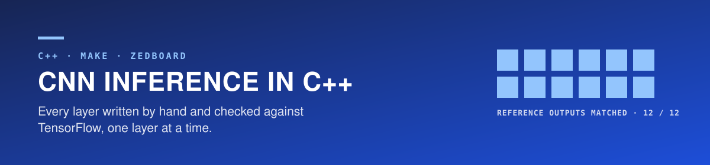

<div align="center">




Iowa State University · CprE 487/587 · Lab 2 · Team 06

[Why](#why) · [Where this lab fits](#where-this-lab-fits) · [Progress](#progress) · [Results](#results) · [Memory and MACs](#memory-and-mac-estimate) · [Build and run](#build-and-run) · [Limitations](#limitations-and-next-steps)

</div>

---

> **Where it stands — Layers implemented and verified on the lab PC**  
> All 13 layers are written and every one of the 12 TensorFlow reference outputs is reproduced for three test images.  
> Still open: profiling with perf, the ZedBoard run, and the report.

| Reference outputs matched | Max error, full model | Lab PC, per image | ZedBoard, per image |
| :---: | :---: | :---: | :---: |
| **12 / 12** | **4.17 × 10⁻⁷** | **143 ms** | **—** |

| | |
|---|---|
| Period | Original team submission September 2026 · individual re-run started October 7, 2026 |
| Team | 2 — Zach Dixon, Jongwoo Kim |
| This repository | My re-run of Lab 2 from the course framework, checked step by step against the handout. The earlier team source and report are kept in `previous_lab_data/` |
| Stack | C++, Make, TensorFlow/Keras outputs as the reference, ZedBoard |
| Deliverables | <!-- TEMPLATE: link the report PDF and source archive once they exist --> not yet |
| Related labs | [Lab 1 — TensorFlow baseline](https://github.com/devjwk/cpre487lab1), [Lab 3 — MAC units](https://github.com/devjwk/487lab3), [Lab 4 — quantization](https://github.com/devjwk/cpre487lab4), [Lab 5 — hardware integration](https://github.com/devjwk/cpre487lab5) |

## Why

TensorFlow hides what inference costs. Lab 1 measured the model from the outside; this lab rewrites each layer as plain C++ loops so that every multiply-add is visible, countable, and ready to move onto hardware in Labs 3–5. Each layer is checked against the TensorFlow output of the same layer.

## Where this lab fits


## Starting point

- **Framework:** the course template (`course` remote), unmodified. Its own documentation is in [`FRAMEWORK_README.md`](FRAMEWORK_README.md).
- **Weights:** `data/model/` ships with the template. All 16 files are byte-identical to the weights exported in Lab 1, under different names (`conv1_weights.bin` here, `conv2d_weights.bin` there).
- **Test images:** `data/image_{0,1,2}.bin` are the three images from the Lab 1 re-run (pomegranate, miniskirt, German shepherd), converted from `uint8` to float32 in [0, 1] (49,152 bytes each). They replace the course's sample images.
- **Reference outputs:** `data/image_N_data/layer_{0..11}_output.bin` are the TensorFlow outputs of the 12 layers for those images, exported in Lab 1.
- **Import:** `python3 scripts/import_lab1_data.py <lab1_binaries_dir>` regenerates `data/` from a Lab 1 export. The course's original data is still available with `git checkout course/main -- data`.

## Progress

| Step | Status |
|---|---|
| Build the unmodified framework on the lab machine | done |
| Implement each layer (convolution with ReLU, max pooling, flatten, dense, softmax) | done |
| Verify each layer against its TensorFlow reference output | done — lab PC, 3 images |
| Verify whole-model inference | done — lab PC, 3 images |
| Layer formulas and variable descriptions (handout 3.2) | not started |
| Memory and MAC estimate per layer (handout 3.3) | done |
| Run on the ZedBoard | not started |
| Report | not started |

## Results

Measured on the lab PC (g++ `-O3`, single thread); full output in [`results/x86_run.txt`](results/x86_run.txt). Each layer is tested alone: its input is the TensorFlow output of the previous layer, so errors cannot carry over. Error is the largest element-wise difference over the three test images; time is the mean of the three.

| # | Layer | Output | Max error vs. TensorFlow | Time (ms) | Share |
|---|---|---|---|---|---|
| 0 | conv1 5×5 | 60×60×32 | 3.94 × 10⁻⁷ | 8.216 | 5.7% |
| 1 | **conv2 5×5** | 56×56×32 | 7.75 × 10⁻⁷ | **88.287** | **61.5%** |
| 2 | max pool 1 | 28×28×32 | 0 | 0.091 | 0.1% |
| 3 | conv3 3×3 | 26×26×64 | 4.17 × 10⁻⁷ | 12.966 | 9.0% |
| 4 | conv4 3×3 | 24×24×64 | 7.15 × 10⁻⁷ | 23.103 | 16.1% |
| 5 | max pool 2 | 12×12×64 | 0 | 0.040 | 0.0% |
| 6 | conv5 3×3 | 10×10×64 | 9.54 × 10⁻⁷ | 4.034 | 2.8% |
| 7 | conv6 3×3 | 8×8×128 | 9.54 × 10⁻⁷ | 5.157 | 3.6% |
| 8 | max pool 3 | 4×4×128 | 0 | 0.007 | 0.0% |
| 9 | flatten | 2048 | 0 | 0.002 | 0.0% |
| 10 | dense1 | 256 | 5.72 × 10⁻⁶ | 1.545 | 1.1% |
| 11 + 12 | dense2 + softmax | 200 | 8.94 × 10⁻⁸ | 0.064 | 0.0% |

The cosine similarity reported by the framework is 100% for every row. TensorFlow's last layer includes the softmax, so dense2 and softmax are tested together against that one reference.

**Whole model, image in to class probabilities out**

| Image | Time | Max error | Predicted class (confidence) | TensorFlow in Lab 1 |
|---|---|---|---|---|
| 0 pomegranate | 143.3 ms | 4.17 × 10⁻⁷ | 170 (0.729327) | 170 (0.7293) |
| 1 miniskirt | 143.3 ms | 1.71 × 10⁻⁷ | 106 (0.103273) | 106 (0.1033) |
| 2 German shepherd | 143.2 ms | 2.09 × 10⁻⁷ | 128 (0.21062) | 128 (0.2106) |

The six convolutions take 98.7% of the time and conv2 alone 61.5%, the same layer that dominated the TensorFlow profile in Lab 1.

## Memory and MAC estimate

Calculated from the layer dimensions (handout 3.3); every value is a 32-bit float. A MAC is one multiply-accumulate.

| # | Layer | Output buffer (bytes) | Weights + bias (bytes) | MACs | MAC share | Measured time share |
|---|---|---|---|---|---|---|
| 0 | conv1 | 460,800 | 9,728 | 8,640,000 | 6.57% | 5.7% |
| 1 | **conv2** | 401,408 | 102,528 | **80,281,600** | **61.01%** | **61.5%** |
| 2 | max pool 1 | 100,352 | 0 | 0 | | 0.1% |
| 3 | conv3 | 173,056 | 73,984 | 12,460,032 | 9.47% | 9.0% |
| 4 | conv4 | 147,456 | 147,712 | 21,233,664 | 16.14% | 16.1% |
| 5 | max pool 2 | 36,864 | 0 | 0 | | 0.0% |
| 6 | conv5 | 25,600 | 147,712 | 3,686,400 | 2.80% | 2.8% |
| 7 | conv6 | 32,768 | 295,424 | 4,718,592 | 3.59% | 3.6% |
| 8 | max pool 3 | 8,192 | 0 | 0 | | 0.0% |
| 9 | flatten | 8,192 | 0 | 0 | | 0.0% |
| 10 | **dense1** | 1,024 | **2,098,176** | 524,288 | 0.40% | 1.1% |
| 11 | dense2 | 800 | 205,600 | 51,200 | 0.04% | 0.0% |
| 12 | softmax | 800 | 0 | 0 | | 0.0% |
| | Total | 1,397,312 | 3,080,864 | 131,595,776 | | |

With the 49,152-byte input image the model needs about 4.5 MB, because the framework allocates every layer's output buffer up front. Convolution MACs are output values × kernel height × kernel width × input channels; dense MACs are inputs × outputs.

- **MAC count predicts time.** For all six convolutions the MAC share and the measured time share differ by less than one percentage point.
- **Memory and compute have different bottlenecks.** dense1 holds 68% of the parameters but does 0.4% of the MACs; conv2 does 61% of the MACs with 3.3% of the parameters.

## Build and run

```bash
make build      # 'make help' lists all targets; run 'make clean' first after changing a header
./build/ml      # runs the framework's checks
```

ZedBoard instructions are in [`FRAMEWORK_README.md`](FRAMEWORK_README.md).

## Repository layout

```
src/                    framework source; layers are in src/layers/
results/                test output from the lab PC
data/                   weights, test images and per-layer reference outputs (imported from Lab 1)
scripts/, zedboard/     ZedBoard build, flash and file-transfer tools
CprE487_587_Lab2.pdf    lab handout
FRAMEWORK_README.md     the framework's original README
previous_lab_data/      first team implementation (src/), its report, and the README of the old repository
assets/                 README banner and figure
```

## My role

<!-- TEMPLATE: write this yourself once the work is done. -->

## What I learned

<!-- TEMPLATE: write this yourself once the work is done. -->

## Limitations and next steps

<!-- TEMPLATE: extend as the remaining steps are done. -->
- Not run on the ZedBoard yet; all numbers are from the lab PC.
- Each timing is the mean of three runs of one unoptimized, single-threaded implementation. The threaded, tiled and SIMD variants only call the naive one.
- Dense 2 has no reference output of its own (TensorFlow applies softmax inside that layer), so it is only checked together with softmax.
- The framework's `compareWithin` returns false for identical data; the tests use `compareWithinPrint` and the maximum error instead.
