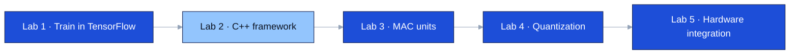

Iowa State University · CprE 487/587 · Lab 2 · Team 06

[Overview](#overview) · [Where this lab fits](#where-this-lab-fits) · [My role](#my-role) · [Results](#results) · [Limitations](#limitations-and-next-steps)

---

> **Where it stands — Complete**  
> All 12 layers and the full model match TensorFlow, and inference is timed on a lab PC and a ZedBoard.  
> Arithmetic is 32-bit floating point here; quantization follows in Lab 4.

| Max error vs TensorFlow | Lab PC | ZedBoard | Conv2 share of MACs |
| :---: | :---: | :---: | :---: |
| **2.38 × 10⁻⁷** | **147 ms / image** | **2,266 ms / image** | **61%** |

| | |
|---|---|
| Period | September 2026 |
| Team | 2 — Zach Dixon, Jongwoo Kim |
| My role | Layer implementation and performance measurement |
| Stack | C++, Make, TensorFlow/Keras (reference), ZedBoard |
| Report | [Lab 2 report (PDF)](report/lab2_report_06.pdf) |
| Next labs | [Lab 3 — MAC units](https://github.com/devjwk/487lab3), [Lab 4 — quantization](https://github.com/devjwk/cpre487lab4) |

## Overview

The model has six convolution layers, three max-pool layers and two dense layers, and classifies 64×64 images into 200 classes.

- **Problem:** TensorFlow hides what inference costs. To design hardware for it, we needed our own implementation where every multiply-add is visible and countable.
- **What we built:** each layer written with plain `for` loops inside the course framework, loading the weights exported from our Lab 1 model.

## Where this lab fits

## My role

- Set up this repository and worked on the layer implementation.
- Measured and presented the performance results: per-layer time, MAC counts, and the PC versus ZedBoard comparison.

Zach built the timing and logging structure.

## What I learned

**Technical**
- Counting multiply-adds predicts where time goes. Conv2 performs 80.3 M of the model's 131.6 M MACs (61%) and was the slowest layer in TensorFlow, on the PC, and on the ZedBoard.
- Memory and compute are different bottlenecks: dense1 holds the most weights (2.1 MB) but does only about 0.5 M MACs.
- Verifying one layer at a time by feeding it the reference output of the layer before it, so errors cannot hide or accumulate.

**Teamwork**
- `perf` was not installed on the lab machines, so we timed both platforms with the framework's own timer to keep the comparison fair.
- Splitting a seven-minute demo and preparing for questions.

## Resources used

- Course DNN framework template (`cpre487-587-dnn-framework`) and the Lab 2 handout
- TensorFlow/Keras outputs from Lab 1 as the reference
- Sze et al., *Efficient Processing of Deep Neural Networks*

## Results

- All 12 layers and the full model match TensorFlow: maximum error 2.38 × 10⁻⁷, cosine similarity 100%.
- One image takes 147 ms on the lab PC and 2,266 ms on the ZedBoard, about 15 times slower.
- Conv2 takes 61.7% of the time on the PC and 59.8% on the ZedBoard.

## Limitations and next steps

- The loops are naive: no cache blocking, SIMD or threading.
- All arithmetic is 32-bit floating point. Lab 4 quantizes it to 8, 4 and 2 bits.
- Since conv2 dominates on every platform, it is the first layer to move to hardware (Labs 3 and 5).
